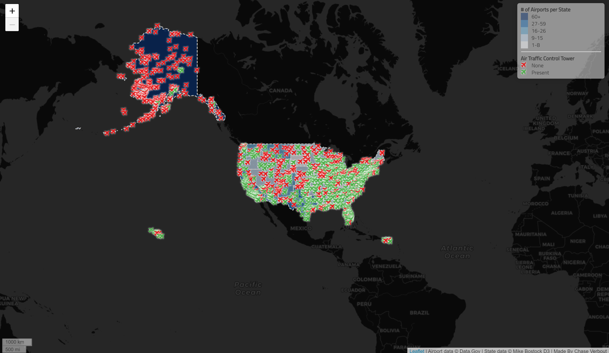

# Interactive Leaflet US Airport Web Map

## By Chase Verbout
The purpose of this project is to exemplify my ability to create an interactive web map using javascript, css, and html. The map was created using several libraries including leaflet, ajax, chroma, font-awesome, jquery, and Titillium Web font. The map uses airport data for data.gov, State data collected by Mike Bostock from D3, and a dark basemap from cartocdn. The map affords interactive plane markers in place of airports that when clicked provide the name of that airport. They also vary by color to convey whether or not that airport has an air track control tower. The underlying layer on the map is a choropleth showing the number of airports by state. The map contains other features such as a legend, scale, attribution, and zoom capabilities.

# Acknowledgements
This assignment and resources were provided by Bo Zhao for GEOG 458 at the University of Washington - Seattle

**Link:** https://cverbout.github.io/usAirportMap/index.html
